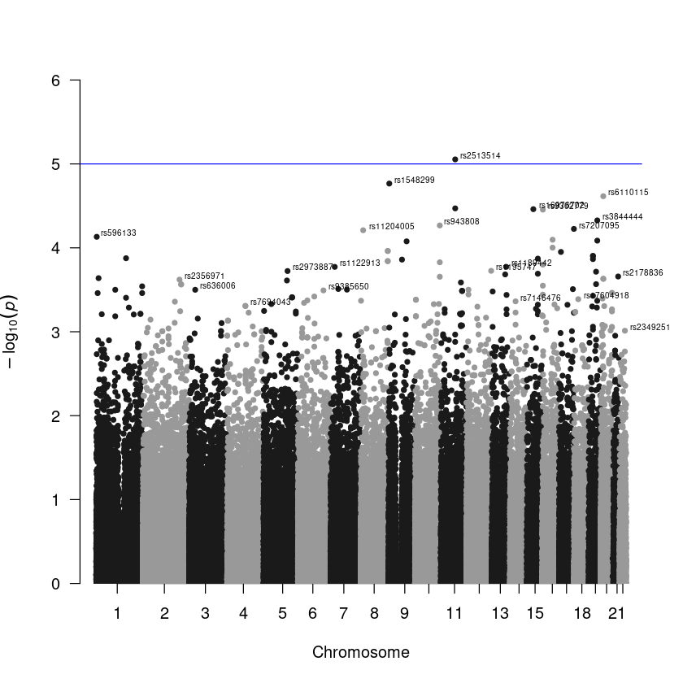
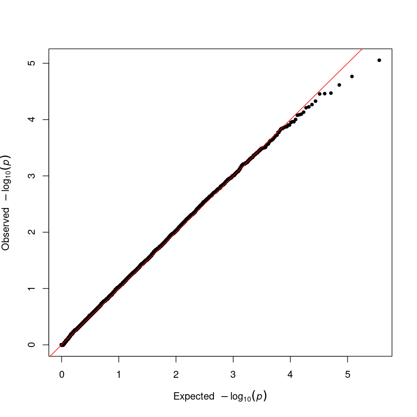
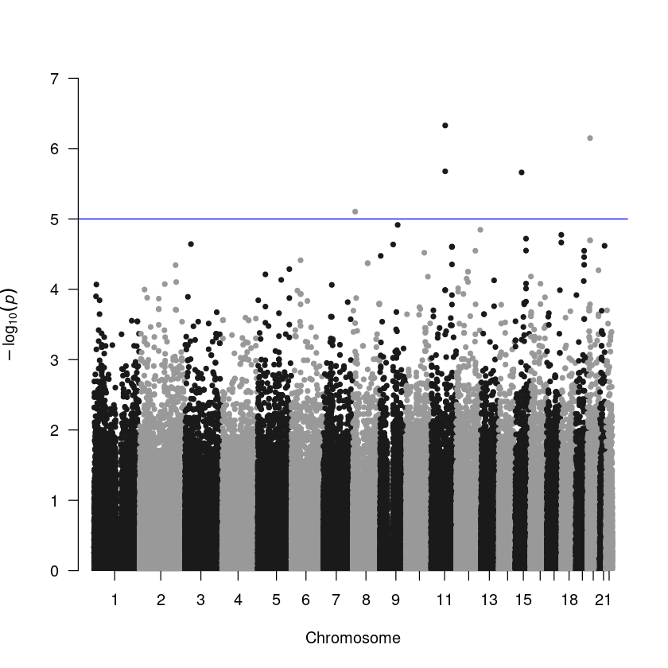
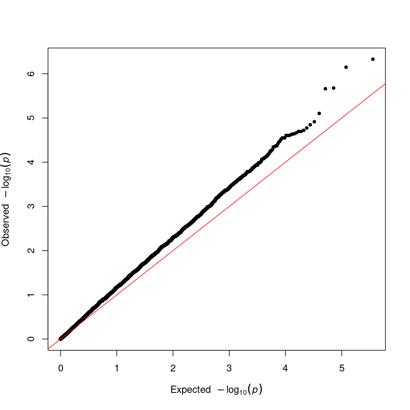
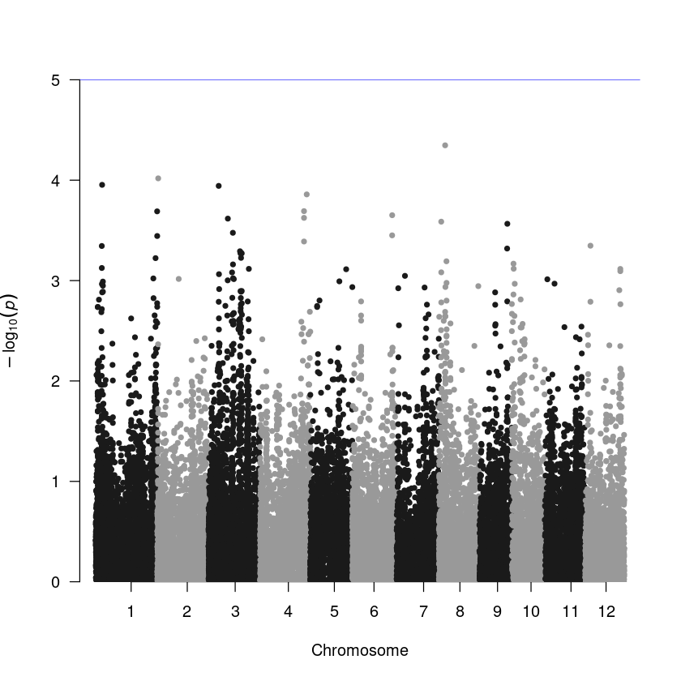

# Genome-wide association study
## Table of content

- [Introduction](#introduction)
- [Task 1: A simple GWAS using R](#task-1--a-simple-gwas-using-r)
    - [Reading in the data](#reading-in-the-data)
    - [Test run on the first locus](#test-run-on-the-first-locus)
        - [Step 1](#step-1)
        - [Step 2](#step-2)
        - [Step 3: Chi-square test](#step-3-chi-square-test)
- [Task 2: Whole-genome association study](#task-2-whole-genome-association-study)
    - [Step 1: Create a data frame with 4 columns](#step-1-create-a-data-frame-with-4-columns)
    - [Step 2: For-loop](#step-2-for-loop)
    - [Step 3: Manhattan plot](#step-3-manhattan-plot)
    - [Step 4: Q-Q plot](#step-4-q-q-plot)
- [Task 3: Simple GWAS using PLINK](#task-3-simple-gwas-using-plink)
    - [Step 1: Run association study by PLINK in the terminal](#step-1-run-association-study-by-plink-in-the-terminal)
    - [Step 2: Loading the results](#step-2-loading-the-results)
    - [Step 3: Manhattan plot](#step-3-manhattan-plot-1)
    - [Step 4: Q-Q plot](#step-4-q-q-plot-1)
- [Task 4: [Advanced] GWAS linear mixed model](#task-4-advanced-gwas-linear-mixed-model)
    - [Performing GWAS evaluation](#performing-gwas-evaluation)
    - [Making the Manhattan plot](#making-the-manhattan-plot)

## Introduction
Welcome to the lab practice. Today, we will work on the human data that passed our quality control yesterday. There will be three sections in today’s practice:

- A simple association study using R
- A simple association study using PLINK
- Optional: GWAS linear mixed model using R.  

Alternatively, the data set we will be using today can be found [here](https://github.com/troe27/UU-GWAS03/raw/refs/heads/main/data/human.filtered.vcf.gz), or here: ```/proj/g2020004/nobackup/tilman/gwas02/human.filtered.vcf```

## Task 1 : A simple GWAS using R
Here’s an example of conducting a chi-square test in R. You will be conducting a GWAS test utilizing the chi-square method.

```R
exampleData = data.frame(
    case = c(20, 20, 60),
    control = c(50, 30, 20)
)

result = chisq.test(exampleData)
print(result)
```

    Pearson's Chi-squared test
    data:  exampleData
    X-squared = 34.857, df = 2, p-value = 2.697e-08


#### Reading in the data
Let’s start the GWAS test. First, read the three data-files with the ```human_all``` prefix into ```R``` 
using the ```read_plink()```function in genio package.

```R
library(genio)
data = read_plink('../data/human/human_all')
```


#### test run on the first locus

##### Step 1:
Generate a data frame with only two columns. Remove samples with missing phenotypes or genotypes.

- **Phenotype:** extract phenotype information from the fam data frame (1, 2 indicate this is a case/control study).

- **Genotype:** extract genotype information from the X matrix (the first row). Remove samples which missing genotype information.


```R
# prepare data frame
testData = data.frame(
    peno = data$fam$pheno,
    geno = data$X[1, ]
)

# remove missing value
testData = testData[! is.na(testData$geno), ]
```

| ID       | peno | geno |
|----------|------|------|
| NA18526  | 1    | 0    |
| NA18524  | 1    | 0    |
| NA18529  | 1    | 1    |
| NA18558  | 1    | 0    |
| NA18532  | 1    | 0    |
| NA18561  | 1    | 0    |


##### Step 2:
use the function ```table()``` to convert the data frame into a contingency table . (HINT: ```?table```)

_**Note:** the ```table()``` function will automatically remove rows with missing values._

```R
contTab = table(testData)
contTab
```

|            | geno_0  | geno_1  |
|------------|---------|---------|
| pheno_1    | 34      |  7      |
| pheno_2    | 33      | 14      |


#### Step 3. Chi-square test

```R
fit = chisq.test(contTab)
fit
```

    Pearson's Chi-squared test with Yates' continuity correction

    data:  contTab
    X-squared = 1.3113, df = 1, p-value = 0.2522

  
## Task 2: Whole-genome association study  
Please repeat the same steps you took with the first marker for all the other markers.

#### Step 1: Create a data frame with 4 columns.
- **CHR**: Chromosome number  
- **SNP**: SNP marker ID  
- **BP**: Marker position  
- **P**: p-value (NA for all cells)  


```R
result = data.frame(
    CHR = as.numeric(data$bim$chr),
    SNP = data$bim$id, 
    BP = data$bim$pos,
    P = NA
)
head(result)
```


| CHR | SNP        | BP      | P   |
|-----|------------|---------|-----|
| 1   | rs3094315  | 792429  | NA  |
| 1   | rs4040617  | 819185  | NA  |
| 1   | rs4075116  | 1043552 | NA  |
| ..   | ...  | ... | ..  |
| 1   | rs9442385  | 1137258 | NA  |
| 1   | rs11260562 | 1205233 | NA  |
| 1   | rs6685064  | 1251215 | NA  |


#### Step 2: For-loop
 A for loop can be utilized to conduct a chi-square test on all SNP markers. The p-values can be extracted from each iteration and added to the data frame created in Step 1. It’s essential to remember that R may provide a warning message if the expected value is small; you may ignore them.

```R
### Single core version for all users
for(i in 1:nrow(result)){
    tab = data.frame(geno = data$X[i, ], peno = data$fam$pheno)
    tab = tab[! is.na(tab$geno), ]
    tab = table(tab)   
    fit = chisq.test(tab)
    result$P[i] = fit$p.value
 }


### A parallel version for UNIX-like users. Using up to 75% of threads.
library(parallel)

result$P = unlist(mclapply(1:nrow(result), function(i){
    tab = table(peno = data$fam$pheno, geno = data$X[i, ])
    return(chisq.test(tab)$p.value)
}, mc.cores = detectCores() * 3 / 4))

head(result)
```

A data.frame: 6 × 4

| CHR | SNP        | BP      | P         |
|-----|------------|---------|-----------|
| 1   | rs3094315  | 792429  | 0.2521611 |
| 1   | rs4040617  | 819185  | 0.3826647 |
| 1   | rs4075116  | 1043552 | 0.5475066 |
| 1   | rs9442385  | 1137258 | 0.7876714 |
| 1   | rs11260562 | 1205233 | 0.8945186 |
| 1   | rs6685064  | 1251215 | 0.7921782 |


#### Step 3: Manhattan plot
 To create a Manhattan plot, utilize the manhattan() function within the qqman package. The data frame will already be in the default input format for this function if you use the same column names as shown in Step 1. Additionally, use the annotatePval = 0.01 option to annotate peaks with a p-value < 10-4.

Check [this webpage](https://r-graph-gallery.com/101_Manhattan_plot.html) for more information.

```R
library(qqman)
manhattan(result, annotatePval = 0.01)
```



#### Step 4. Q-Q plot.

 The [QQ plot](https://en.wikipedia.org/wiki/Q%E2%80%93Q_plot) serves as a crucial tool for identifying issues in a GWAS. To use it, input the vector of p-values from your association result into the ```qq()``` function.

```R
qq(result$P)
```



## Task 3: simple GWAS using PLINK
There are more efficient ways to conduct association tests than using R. For instance, one can use well-developed software like PLINK. For more information, check the [PLINK website](https://www.cog-genomics.org/plink/1.9/assoc). 

#### Step 1: Run association study by PLINK in the terminal.

```bash
 plink --bfile human_all -assoc --out human_all
```

#### Step 2: loading the results
 Read association test results (```*.assoc```) table by into R with the ```read.table()``` function.

```R
library(data.table)
assoc = fread('../data/human/human_all.assoc')
head(assoc)
```

A data.table: 6 × 10

| CHR | SNP        | BP      | A1 | F_A     | F_U     | A2 | CHISQ  | P       | OR    |
|-----|------------|---------|----|---------|---------|----|--------|---------|-------|
| 1   | rs3094315  | 792429  | G  | 0.14890 | 0.08537 | A  | 1.6840 | 0.1944  | 1.8750 |
| 1   | rs4040617  | 819185  | G  | 0.13540 | 0.08537 | A  | 1.1110 | 0.2919  | 1.6780 |
| 1   | rs4075116  | 1043552 | C  | 0.04167 | 0.07317 | T  | 0.8278 | 0.3629  | 0.5507 |
| 1   | rs9442385  | 1137258 | T  | 0.37230 | 0.42680 | G  | 0.5428 | 0.4613  | 0.7966 |
| 1   | rs11260562 | 1205233 | A  | 0.02174 | 0.03659 | G  | 0.3424 | 0.5585  | 0.5852 |
| 1   | rs6685064  | 1251215 | C  | 0.38540 | 0.43900 | T  | 0.5253 | 0.4686  | 0.8013 |


#### Step 3. Manhattan plot.
 The result table generated from PLINK is the exact format for the plotting function.

```R
library(qqman)
manhattan(assoc)
```




#### Step 4. Q-Q plot

```R
qq(assoc$P)
```




You may notice a difference in results from R and PLINK. To prevent any confusion, please reference the help manual for more information on the chi-square test (```chisq.test()```) and [Yate’s correction for continuity](https://en.wikipedia.org/wiki/Yates%27s_correction_for_continuity).

_Based on the Q-Q plot outcome, which result is superior?_

## Task 4: [Advanced] GWAS linear mixed model
You can choose from different R packages for fitting GWAS linear mixed model. Some of these packages are ```GWAStools```, ```rrBLUP```, and ```sommer```. Among these choices, my personal preference is the ```sommer``` package.

We will use a [rice dataset from Cornell University in 2011](https://www.nature.com/articles/ncomms1467). Raw data can be found on the [rice diversity website](http://www.ricediversity.org/data/sets/44kgwas/).

```R
library(sommer)
```


Read PLINK binary format files (rice.bed, rice.bim, rice.fam). This dataset contains various trait measurements. You can select one from the file rice_phenotype.txt and incorporate phenotype information into the fam data frame.

Read binary files by the ```genio()``` function.

```R
data = read_plink('../data/rice44k/rice')
```

Read the phenotype table (I will choose plant height in the answer version)

```R
peno = fread('../data/rice44k/rice_phenotype.txt')
peno = peno[, c(1, 13)]
colnames(peno) = c('id', 'pheno')
```

Merge ```data$fam``` and ```peno```. The ```NSFTVID``` in the phenotype table is its individual ID.

```R
data$fam$pheno = peno$pheno
peno = data$fam
```

Start preparing the input data for the ```GWAS()``` function in the ```sommer``` package.

- The genotype matrix needs to be transposed (row: samples, column: markers).
- Genotype coding should be converted from (0, 1, 2) to (-1, 0, 1).
- Missing values in genotype coded as 0. (Today, we’re keeping it simple, but there are more effective methods for imputing missing values.)
- The row names of the genotype matrix should be identical to the ID in the phenotype table.
Make sure the sample id is factorized.

```R
geno = t(data$X) - 1
geno[is.na(geno)] = 0
peno$id = factor(peno$id)
```

Now we need to generate an additive relationship matrix using the ```A.mat()``` function.

```R
A = A.mat(geno)
```

Then, we can fit the linear mixed model using the ```GWAS()``` function.

```R
fit = GWAS(fixed = pheno~1, random = ~vsr(id, Gu = A), data = peno, gTerm = "u:id", M = geno)
```

#### Performing GWAS evaluation
Create a dataframe for plotting the function. You should have ```CHR```, ```SNP```, ```BP```, and ```P``` in four columns. The p-value could be calculated by ```10^(-as.numeric(fit$scores))).```

```R
asso = data.frame(
    CHR = as.numeric(data$bim$chr),
    SNP = data$bim$id,
    BP = data$bim$pos,
    P = 10^(-as.numeric(fit$scores))
)
asso = asso[asso$P > 0, ]
```

#### Making the Manhattan plot.
To create a Manhattan plot, please keep in mind that if the p-value is 0, its log value becomes infinity, which cannot be plotted. Therefore, kindly remove the data point before proceeding with the plot.

```R
library(qqman)
qqman::manhattan(asso)
qqman::qq(result$P)
```


